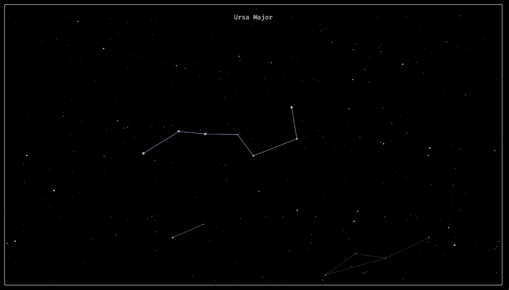

# Astraea

A Stellarium game made for The icam Game jam 2024, using the Bevy game engine

Star data from : [YaleBrightStarCatalog (Bretton Wade)](https://github.com/brettonw/YaleBrightStarCatalog/blob/master/bsc5-short.json) (MIT License, Copyright (c) 2016 Bretton Wade)

Constellation data from :[Lizard Tail (Isana Kashiwai)](https://www.lizard-tail.com/isana/lab/starlitnight/)

## Tips

There is one information that is not yet explained in the game : you can left click and drag to move around.

## Demo

You can check it out [on my website](https://www.penwing.org/assets/games/Astraea/web/index.html)

but here is a sneak peek :

